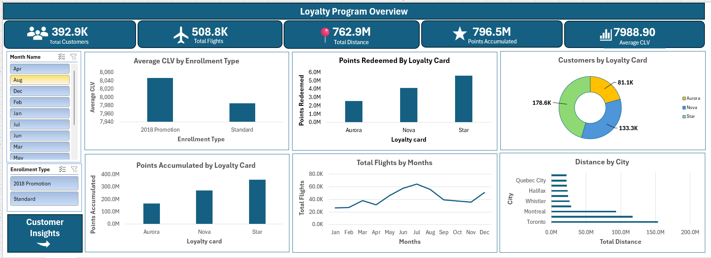
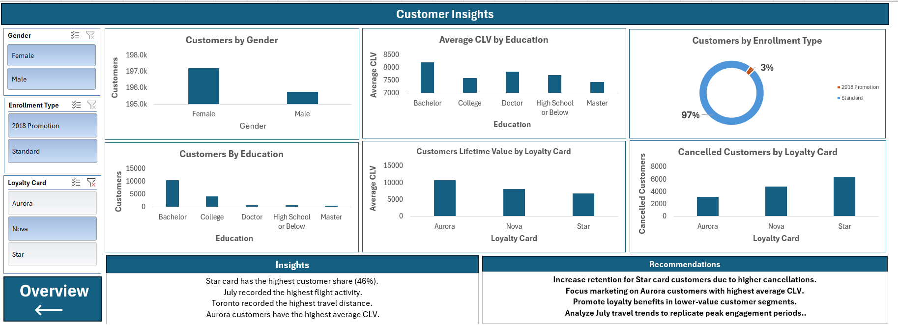

# Customer Loyalty Dashboard (Excel)

## Project Overview

Interactive Excel dashboard built to analyze customer loyalty program performance using Pivot Tables, Pivot Charts, Slicers, and Data Model.

## Tools Used

* Microsoft Excel
* Pivot Tables
* Pivot Charts
* Slicers
* Data Model

## Key Metrics

* Total Customers
* Total Flights
* Total Distance
* Points Accumulated
* Average CLV

## Dashboard Pages

### Loyalty Program Overview

* Flights by Month
* Distance by City
* Points Accumulated by Loyalty Card
* Points Redeemed by Loyalty Card
* Avg CLV by Enrollment Type
* Customers by Loyalty card

### Customer Insights

* Customers by Gender
* Customers by Education
* Average CLV by Education
* Cancelled Customers by Loyalty Card
* CLV by Loyalty Card
* Customers by Enrollment Type

## Key Insights

* Star card has the highest customer share.
* July recorded the highest flight activity.
* Toronto recorded the highest travel distance.
* Aurora customers have the highest average CLV.

## Dashboard Screenshots

### Overview

### Customer Insights

